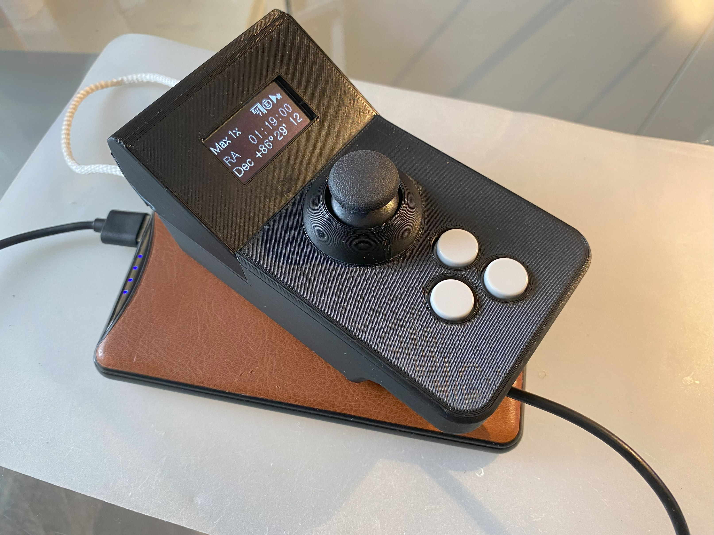
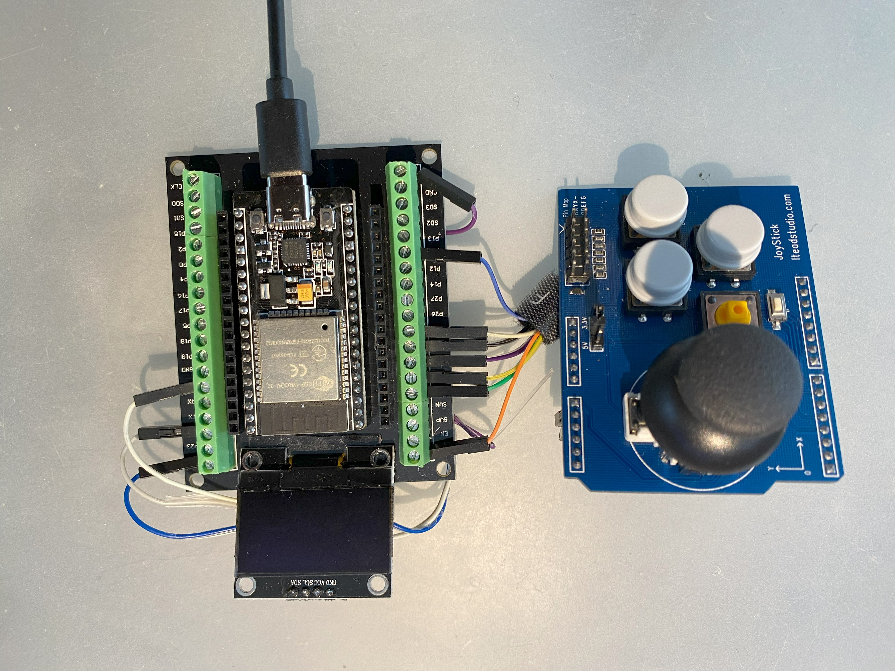

# Rapid bulky wSHC by apos

Reference_layout_V01a.jpg  

A very early prototype :-)  
 

Rapid_Bulky_wSHC_V39_M1 / Near final version of reference design V01  
    

## YouTube video
In a hurry? This video is 50minutes long. But you can skip some chapters if you are only interested in certain aspects (see timeline in video). But be warned: you might miss important informations, especially if you are new to the subject ;-) 

But please afterwards read the informations carefully on this side to be able to understand what to order and what to expect :-)

The video gives all informations needed from Adam to Eve, also includes an exlanation of ESP32 form factors. But it is not on programming the ESP32 with Arduino or Platform.IO IDE - only for assembling the parts. Please use the timestamps to possible switch between video parts:

- https://www.youtube.com/watch?v=VndzQj0gUMc 

Have fun. 

## Preface
This is for building a wireless [Smart Hand Controller (wSHC)](https://onstep.groups.io/g/main/wiki/7152) for the [OnStep telescope controller](https://onstep.groups.io/g/main/wiki/Home) with

- ESP32 (different layouts will be supported over time
- Breakout board (ESP32 30 pin, see media) with e.g. dupont connectors 
- Joystick shield 
- External battery pack or power surge (5V, 6-14V - depending on hardware)

Many thanks to [Howard Dutton](http://www.stellarjourney.com/) which is the founder and lead developer of the [OnStep telescope controller](https://onstep.groups.io/g/main/wiki/Home). He did the main work on altering the source code so that things are working with the joystick shield (which they did not in the first place).

*Annotation*: **this is not the documentation for an SHC implementation**. This project only gives you reference designs among many others and a combination of hardware that is tested and works, a 3d model to print and some hints about getting things done. 

**You need in any case:**

1. A working [OnStep with wireless functionality](https://onstep.groups.io/g/main/wiki) (no simulation mode possible - you will not get over the start screen in SHC)
2. Knowing how to configure the [Smart Hand Controller](https://onstep.groups.io/g/main/wiki/Smart-Hand-Controller) and the ability to program the ESP32 and upload it (Arduino IDE, Platform.io).
 
 CS [Axel](https://avvp.de/portfolio-view/axel-pospischil)
 
## History

Everything started with the OnStep chat topic: "[wSHC (wireless Smart Hand Controller) with standard ESP32-Board and standard joystick shield (anyone?)](https://onstep.groups.io/g/main/message/51440)". I had laying around some ESP32 and a Joystick board with buttons. When I found out, that the SHC is simply that, I liked the idea for prototyping or even more. I did not order a PCB, extra parts or doing welding at the weekend just to get started with an wSHC when the list of components seem to be so simple. This lead to this project. 

## Purpose

Be able to rapidly build a wireless Smart Hand Controller with common standard parts and a oystick shield: 

- Build to use with **button / joystick shield**
- Build a **wireles** SHC - no ST4 or cable
- Build it **fast** (simply put things together)
- Build it **cheap** (standard compnents)
- In the first place use standard components. You should get every part within days in your country or your local hardware store
- No long waiting China-imports necessary in the first place just to get started
- **No welding** required (dupont connector, probably using a crimp tool if you like special cable length)
- **No PCB** necessary
- Battery (for now) not included - use with a small, external battery pack

The intended usage is prototyping, testing. But it also meets the requirements to use it in the field as a full featured and robust wSHC.

The model is bulky, because of the use of standard breakout boards and shields. There exist others which use PCB's. This project gives you the time to do a more sophisticated wSHC without having one in the meantime :-)

### What you need
It depends on the reference design (version) of the "bulky wSHC" you like to build.

But it boils down to:

1. Access to a 3D printer with PLA (or other materials which can be fine printed)
2. [A standard ESP32 with 30 pim](media/ESP32_30pin_left_layout_comparison.jpg) (just the baseplate) best with USB-C jack
3. [An Arduino form factor breakout board for the ESP32](media/ESP32-30pin-BO1-ESP32_compact_breakout_and%20ESP32.jpg) (Dupont variant) with USB-C (V) and a standard 5/2.1 mm jack (4.5 to 16V) - other breakout boards might fit. But these are very common. 
4. [A Joystick shield](hmedia/ITEAD_Joystickshield_DS.pdf). The one I use here is very small. Reference Design V01 uses this one.
5. An OLED 1,3 inch screen (I use a white colored one and put a red foil on it for the night)
6. 10-15 cm long Dupont cables (female 2 female for breakout board 1). Or use a crimp toolset and cables to make your own length (which is better). You can save a lot of time, if you buy preconfigured dupont cables (2,4,5 bundled). If you use headers, that include a whole row of pins, this is more robust and also will lead to less misconfiguration.
7. A standard USB powerbank, battery pack or for the breakout board no. 1 an 6,5 to 16V DC input (standard 5/2.1 mm jack) - until now there is no much space for a battery.  
8. A matching USB-cable for programming and loading the ESP32 / Board (USB-C, Micro-USB, Mini-USB)

### Costs 
#### Total costs

| Total per unit | Version | Notes |
| ------------- | -------- | ------------- | 
| 15-20 € | V01 | if you are in a hurry (Amazon/Ebay) and well suited otherwise (battery, cables) |
| under 10 € | V01 | if you have time and will save a lot of costs you can get everything from China sellers. This is intersting, if you have a class, order more than one parts and want to build this for a group of people.  |
| 30+ € | All | More, if you start from scatch and need cables, battery pack, crimp tool |

#### All Versions (parts needed)

| Part | Version | Notes | Cost |
| ------------- | -------- | ------------- | ----------- |
| Cables | All | Use only **good quality, standard dupont cables** 10 to 15 cm long or use preconfigured 2,3,4,5 pin ones. It is wise to use cable headers. Single connections could be troublesome. | Cents |
| Cables | All (opt.) | **Crimpset**, this is a good investment for many projects | 30-50 € |
| Battery Pack | All | Power supply, 5V powerbank (USB-C/Micro-USB), 5mm/2.1mm jack (6 to 14,5 V) | depends if you have to buy or can reuse  |

**Reference design 01 (V01)**

| Part            | Version | Notes                                                                             | Cost  |
|-----------------|---------|-----------------------------------------------------------------------------------|-------|
| ESP32           | V01     | 30pin                                                                             | 5-7 € |
| Breakout board  | V01     | for ESP32/30pin Arduino form factor                                               | 5 €   |
| Joystick shield | V01     | ITEAD (seems to be not avaiable very easy). Very slim design. Arduino form factor | 5 €   |
| OLED            | V01     | 1,3 inch                                                                          | 5 €   |
| Filament        | V01     | PLA                                                                               | 2-3 € |
| Cables          | V01     | 10 to 15 cm long (female to female)                                               | Cents |

### Build Time

#### Preparation

3d printing parts
- Fine print (highly recommended): 7-8 hour print (PLA, Prusa MKS3 Quality 0.2mm, 15% infill, only some support)+ 45 minutes for caps
- Draft print (NOT recommended): 4 hour print (PLA, Prusa MKS3 Draft 0.3mm, 20% infill, only some support) + 30 minutes for caps

Cables
- You can save a lot of time, when you use preconfigured cables with Dupont connectors (2 / 4 / 5 in a row). E.g. crimping takes the most of time.
- Crimping is way more better than welding

#### Classroom project

If you already implemented an OnStep controller with people of you astronomy club, it is very easy now to get everything running with a wireless SHC. You will be surprised how much more intuitive this is, than using the handy app.

If you are well prepared (get cables ready, print parts) you will make this in a 3 hour workshop. Included a pause, 30min intro and 30 minutes for asking questions. 

You can save really a lot of money if you order the parts in China (takes usually 2 weeks shipping).

### More to come

- Detailed instructions, video 
- More versions to come (OLED sizes, breakout boards, 30/38 pin layout of ESP32, battery pack,).

# Reference designs (versions)

Any ESP32 and joystick board should work. For real world usage, there should be no bulky things on the top of the board! Pins you can get rid of, but not extra headers. I found this: https://de.aliexpress.com/item/32780304126.html (Keystudio Joystick shield). But it is bigger, I have to alter the design.

Within the folder structure in this repository you will find the different versions (hardware, configuration and 3d model).

## V01 (reference design V01)
### Feature list

- 3D Model [finalize 3d model for V01]([https://github.com/apos/rapid-bulky-wshc-by-apos/issues/2](https://github.com/apos/rapid-bulky-wshc-by-apos/issues/1))
- Configure.h tested: main branch (https://github.com/hjd1964/SmartHandController/commits/main)
- 128x64 OLED 1,3 inch (OLED 2,42 inch to come when code is implemented)
- External battery pack or power needed (USB-C / DC 5/2.1mm jack) 

### Components
This is the most compact combination of hardware I could find out there:

- [ESP32 30pin](https://de.aliexpress.com/item/1005004702430375.html) or ESP32 38pin (with [special breakout board for the 38pin](3d/V01/Breakout_board_2_with_clambs_and_38pin.jpg) )
- [Breakout board 1](https://de.aliexpress.com/item/1005004786802668.html) - very slim, pins on top (which is what you want). You can use others, probably there will be other 3D models in the future. This has an Arduino form factor and simply is the best I could found. 
- Breakout board 2 has clamps and is for 38pin ESP32.
- ITEAD joystick shields (bought them on eBay last year). 
- OLED 1,3'' (2,42'' to come, but need software fix from OnStep project)
- Optional, but recommended for usage in the field: two M3 23mm length (not necessary, because 3d parts should snap together)

#### Breakout board with DC converter and the 30pin ESP32 (recommended version)
This board has many advantages:
- USB-C jack located at the left (and also a Micro-USB Jack in the middle, if you might need one)
- separate round 5/2.1mm DC jack (6.5 to 16 V)
- small form factor
- separate 3,3V and 5V voltage pins
- easy to reach Dupont jacks on the top
 
 
 

#### Breakout board with clamps for ESP32 38pin version
You can use this for prototyping or for getting these 38(plus)-pin ESP32 to run. You can also add a simple battery loading circuit.
This board is simply different
- is a little bigger
- has clamps instead of Dupont jacks (might be also an advantage)
- has no voltage surgery - so you have so use directly the ESP32 USB jack (I do not recommend this for production usage)

  

#### Joystick shield
This design uses an ITEAD joystick shield and pinmapping - see [ITEAD PDF manual](media/V01/ITEAD_Joystickshield_DS.pdf) in the the media/V01 folder. Unfortunately these Joystick boards seem not to be produced any more. V02 will use another shield.  
   
 
It look like so 
  
 
#### V01a with 1,3 inch OLED
Please consider welding right angled pins (4pin header) onto the board (facing inwards) which could give you more space e. g. later on for a battery pack. 
Use the correct 3d model  (1,3) for the OLD housing. 
  

#### V01b with 2,4 inch OLED (NOT READY YET. Needs code change on SHC)
Please consider wleding right angled pins (7pin header) onto the board (facing inwards) which could give you more space e. g. later on for a battery pack.
Use the correct 3d model  (2,4) for the OLD housing. 
 

## V02 (reference design V02) - longer, but more actual Joystick board
This is work in progress (see issues). Have to wait until hardware arrives.

 
 

## More versions to come

Please contribute at the tread [wSHC (wireless Smart Hand Controller) with standard ESP32-Board and standard joystick shield (anyone?)](https://onstep.groups.io/g/main/message/51440) .

## Instructions

Basically  orient yourself on the pinmap of the SHC code for ESP32 and you read the look at the wirering plan in the media directory for the ITEAD joystick shield.

### Dragons ahead

- THERE ARE DIFFERENCES IN HARDWARE SPECs for all of these parts out there.
- THIS IS FORE ESP32 (30pin), an ARDUINO FORM FACTOR BREAKOUT BOARD AND an ARDUINO FORM FACTOR JOYSTICK SHIELD.
- PLEASE LOOK AT THE PICTURES DIRECTORY for the hardware, that is used.

Everything will be reusable for a other projects and can be put apart totally. Nothing is soldered. 

Basically you can do this now wiht every ESP32 and Joystick board, BUT: you should know what you are doing and the 3D model probably will not fit.

### Source code

Dealing with the source code is not easy, especially if you are new to OnStep, to ESP32 development, or to 

1. You need to read carefully the main SHC instructions [howto install the software on the OnStep site -> right side -> Smart Hand Controller](https://onstep.groups.io/g/main/wiki).
2. At time of writing you have to use the [main tree of the SHC software code](https://github.com/hjd1964/SmartHandController/tree/main) to get things running as stated in the [instructions](https://onstep.groups.io/g/main/wiki/7152). This and only this branch contains the necessary code to get things running 
3. You need to add special configuration code to your **Config.h** (section `// KEYPAD`) to get things running. Especially the joystick probably needs fine tuning (hysteresis) and the buttons debounce settings. Probably you need to alter the Joysticks direction (`#define X_PIN#_ACTIVE...`). You can find my Config.h in the config directory within this repository.
- The additional Config.h settings do not exist per default, when you checkout the code. You have to add dem manually. 
- Again: probably it is wise to have a look into the starter [thread on OnStep chat](https://onstep.groups.io/g/main/message/51440) like mentioned above.

This is work in progress, here and in the OnStep SHC source code (tree main). Until now it is limited to special hardware.

### Program ESP32 - Platform.io
I use the Visual Studio code plugin for [platform.io](https://platform.io). Arduino IDE is enough though (and the new 2.0 version works perfectly)

If you work with Platform.io you need:

- special platformio.ini (see platfoioio directory)
- rename SmartHandController.ino to SmartHandController.cpp
- know how to use platform.io (I can and will not give support on this)

BE AWARE: sometimes you have to press the "Download" button on the ESP32 to upload the code and you need the correct driver. Normally the USB-C variants are newer and have no problems.

# 3D-printer model and parts

You find all 3d files for Fusion360 and the 3MF/STL in the **directory "3d" in this repository**. Each one is for a certain version. These files are work in progress. I design with Fusion360 and will update the files after every major milestone.

The parts are very tight (no gap design). I like to use as less as possible screws (if possible no). Some parts have to be glued together. 

The model is bulky, because of the use of standard breakout boards and shields.

- Printer:    I use a Prusa MK3S
- Quality:    Tested with 0.3mm in draft mode. For a nice fit use 0.2mm quality mode . Do not use speed modes because of overhangs (stringing)
- Material:   PLA (in the moment) 1.75 mm - trying to go with PC and PETG, but this has to be tested
- Infill:     15-20% is enough
- Support:    not needed for most parts printed with PLA. Only for the OLED back. This might be not the case for other materials (not tested yet)
- Duration:   5,0 hours with Prusa MK3S in 0.3mm draft mode (everything will fit on the plate of a Prusa Printer). 

Important: 

- **Special orientation** on printer bed needed for some parts (see picture and red rectangles)
- Print the OLED housing and the front cap for the base **separately with support only on printer bed standing right up on the side** Otherwise you could get trouble (parts could go off the print bed, supports might not get off)
- Joystick "ring" and OLED housing back will be **glued** to it's corresponding parts with fast glue.

## Optional print parts

### Pin inlets for different breakout boards

 

## Universal hold

 

## Straps
Put a strong nylon cable into the two holes at the back of the base. You can simply break through the holes with a screw driver. 4mm diameter is default, but you can easily make the bore narrower or bigger.

